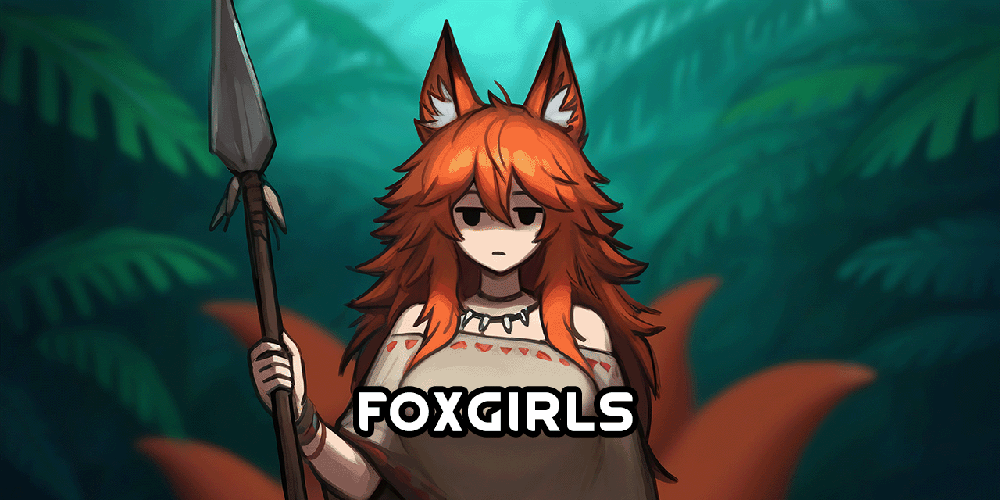

<!--  -->
[requirements]: https://img.shields.io/badge/dynamic/xml?url=https%3A%2F%2Fraw.githubusercontent.com%2FRimCorePlus%2FGenes-Foxkin%2Frefs%2Fheads%2Fmain%2FAbout%2FAbout.xml&query=%2F%2FdisplayName&style=for-the-badge&label=Requires&color=mediumpurple
<!-- [![GPLv3][badge-license]](https://www.gnu.org/licenses/gpl-3.0) -->
[badge-license]: https://img.shields.io/badge/License-GPLv3-lightgray?style=for-the-badge

# [RCP] Genes - Foxkin
\
![Requirements][requirements] [![GPLv3][badge-license]](https://www.gnu.org/licenses/gpl-3.0)

> [!IMPORTANT]
> Requires [RimWorld Biotech](https://store.steampowered.com/app/1826140/RimWorld__Biotech/).\
> Requires [AFU Cosmetic Gene Expanded](https://steamcommunity.com/sharedfiles/filedetails/?id=2880942803).\
> Requires [EBSG Framework](https://steamcommunity.com/sharedfiles/filedetails/?id=3112549163).\
> Integrated with [EyeGenes2](https://steamcommunity.com/sharedfiles/filedetails/?id=2898151329) (optional).\
> Integrated with [SpawnThoseGenes!](https://steamcommunity.com/sharedfiles/filedetails/?id=2898044088) (optional).

## Additions
- Firefox and snowfox xenotypes added to tribal factions
- Rare hemofox xenotype

## Legal
Portions of the materials used to create this mod are trademarks and/or copyrighted works of Ludeon Studios Inc. All rights reserved by Ludeon. This mod is not official and is not endorsed by Ludeon.

Fox icon by Delapouite from [Game-icons.net](https://game-icons.net/) (CC BY 3.0)\
Tongue icon by Delapouite from [Game-icons.net](https://game-icons.net/) (CC BY 3.0)